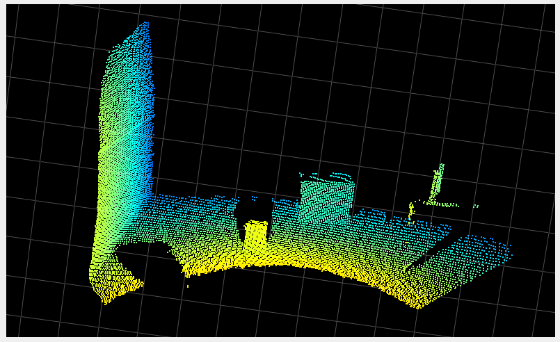
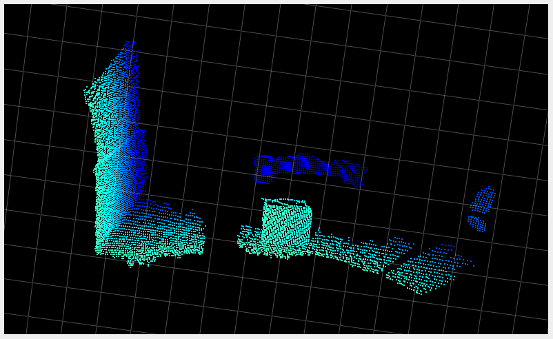

# Offset

## Description
The offset parameter shifts the beginning of the measurement range in space. For instance, when using the 2m mode with an offset of 1m, the O3R will compute distance data for a range between 1 and 3 m from the camera.

Using the offset can allow you to collect distance measurements past the measurement range set by the [mode](modes.md) while taking advantage of the robust point cloud the O3R provides and the specificities of each mode.

The offset can be set at negative values, which brings the end of the measurement range closer to the camera. This can be useful for mitigating [MPI artifacts](INSERT-LINK), for instance, or for avoiding artifacts caused by highly reflective objects (see [stray-light artifacts](../Filters/strayLight.md)), by removing the cause of the artifact from the FoV.

## Example
Let's look at the following scene. Three boxes are positioned in front of the camera at about one, two, and three meters away.

We are using the 2m [mode](modes.md), with all the other settings as default. The table below shows the point cloud for multiple values of the offset.

| Offset (meters)| Point Cloud|
|--|--|
| -0.5| |
| 0| |
| 1.5| |
| 2.5| |

> Note: In the last image where the offset is set to 2.5m, we can see that the noise is higher than in the other images. This is due to the distance to the camera, with which the noise increases, and to the fact that the most robust measurement is in the middle of the range, which is from around 3 to 4 m in the case of the last example. The ground in front of the box is outside of the robustness area.